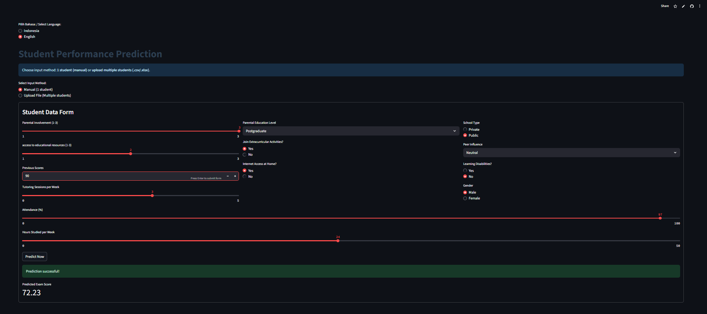
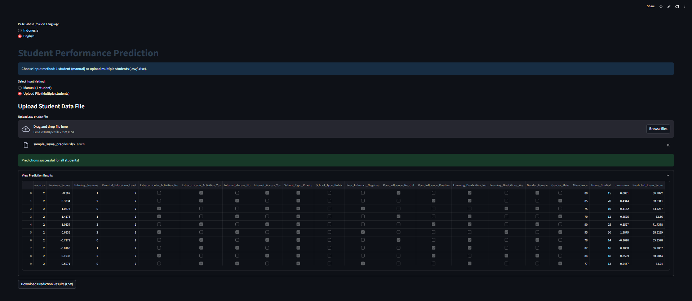

# Junilai
Junilai is an AI-powered exam score prediction application.
The application helps teachers identify students at risk of scoring below the standard, enabling early intervention.

The application uses dataset from [Kaggle](https://www.kaggle.com/datasets/lainguyn123/student-performance-factors). 

[Click here to open the Streamlit app](https://junilai.streamlit.app/)

## Application Preview
This application provides two data input methods:

1. Demo Video
[Click here to see a demo](demo/DemoPN.mp4)

2. Input manual (singel student) - fill an interactive form.

Users can enter data for one student manually via an interactive

2. Upload file (multiple students) - submit a CSV/XLSX with many students and get batch predictions

Users can upload .csv or .xlsx files containing data from multiple students for mass prediction. The prediction results can be downloaded in CSV format.

Upload File (Multiple Students) preparing your CSV/XLSX
- Supported formats: .csv or .xlsx. For .xlsx the environment must have openpyxl installed.
- Important: The app expects specific column names. Provide exactly these columns (names are case-sensitive and must include underscores wher shown):

```bash
Example CSV
Parental_Involvement,Access_to_Resources,Previous_Scores,Tutoring_Sessions,Parental_Education_Level,Extracurricular_Activities_No,Extracurricular_Activities_Yes,Internet_Access_No,Internet_Access_Yes,School_Type_Private,School_Type_Public,Peer_Influence_Negative,Peer_Influence_Neutral,Peer_Influence_Positive,Learning_Disabilities_No,Learning_Disabilities_Yes,Gender_Female,Gender_Male,Attendance,Hours_Studied
2,2,70,1,College,False,True,False,True,True,False,False,True,False,True,False,True,False,80,15
2,2,80,2,College,False,True,True,False,True,False,False,False,True,True,False,False,True,85,20
```


Example XLSX
| Parental_Involvement | Access_to_Resources | Previous_Scores | Tutoring_Sessions | Parental_Education_Level | Extracurricular_Activities_No | Extracurricular_Activities_Yes | Internet_Access_No | Internet_Access_Yes | School_Type_Private | School_Type_Public | Peer_Influence_Negative | Peer_Influence_Neutral | Peer_Influence_Positive | Learning_Disabilities_No | Learning_Disabilities_Yes | Gender_Female | Gender_Male | Attendance | Hours_Studied |
|----------------------|---------------------|-----------------|-------------------|--------------------------|--------------------------------|--------------------------------|--------------------|---------------------|--------------------|-------------------|-------------------------|-------------------------|--------------------------|--------------------------|---------------------------|---------------|-------------|------------|---------------|
| 2                    | 2                   | 70              | 1                 | College                  | FALSE                          | TRUE                           | FALSE              | TRUE                | TRUE               | FALSE             | FALSE                   | TRUE                    | FALSE                    | TRUE                     | FALSE                     | TRUE          | FALSE       | 80         | 15            |
| 2                    | 2                   | 80              | 2                 | College                  | FALSE                          | TRUE                           | TRUE               | FALSE               | TRUE               | FALSE             | FALSE                   | FALSE                   | TRUE                     | TRUE                     | FALSE                     | FALSE         | TRUE        | 85         | 20            |


To try this application, you can use the sample dataset provided in this repository.  
[Download sample_data.csv](./dataset/sample_data.csv)  
[Donwload sample_data.xlsx](./dataset/sample_data.xlsx)

## Technologies Used
- Python
- Streamlit
- Pandas
- Numpy
- Matplotlib
- Seaborn
- Scikit-learn
- Joblib

## Installation & Setup

```bash
1. Clone the repository
git clone https://github.com/AgiF27/Junilai.git
cd predicted-exam-scores

2. Create and activate a virtual environment
python -m venv venv
venv\Scripts\activate # Windows
source venv/bin/activate # macOS/Linux

3. Install dependencies
pip install -r requirements.txt

4. Run the application locally
streamlit run app.py